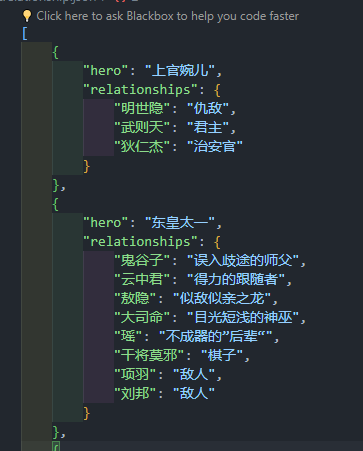
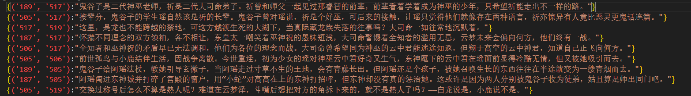

# 文件结构说明

## resource.json

该文件记录了王者荣耀这款手游中，各英雄与其对应的序号关系，以json的形式保存，后续数据也可以用此文件的数据，将英雄和序号对应。

## WZrelationship.json

+ hero：字符传形式，该字段记录了当前的主人公
+ relationship: 该字段为字典形式，分别记录了hero主人公对其他人的态度和看法，如图所示：

## WZrelationship_dialoge.jsonl

王者英雄相互之间的具体关系是一样的，这里不考虑顺序问题，只需要记录一对英雄的关系内容即可。

+ (‘189’,’517’)：key值，189和517采用的上述文件resource.json中的英雄与序号编号关系，此处来指代两位英雄。
+ string：value值，指两位英雄之间的具体关系。