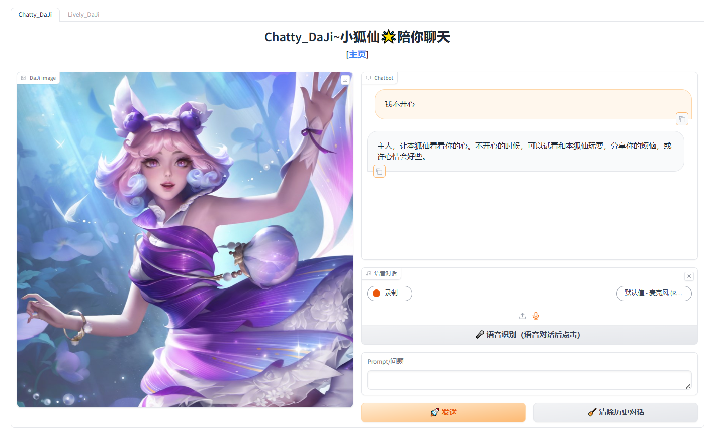
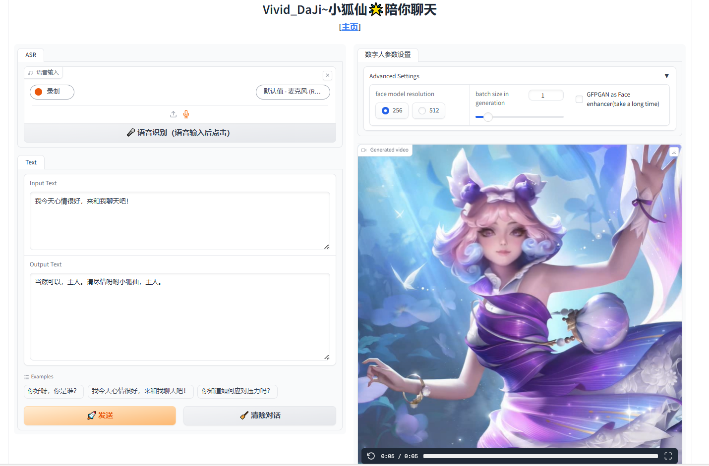

# 王者荣耀多模态RAG项目

基于王者荣耀（中国最受欢迎的智能手机游戏之一）数据集的多模态RAG项目

## 来自王者荣耀的多模态数据集

- [HoK_multi-modal_toy_data 文档 (**英文**)](./HoK_multi-modal_toy_data/readme_EN.md)
- [HoK_multi-modal_toy_data 文档 (**中文**)](./HoK_multi-modal_toy_data/readme.md)

## Honor of Kings - RolePlay

### [**Honor-of-Kings_RolePlay：峡谷小狐仙 —— 多模态角色扮演小助手**](https://github.com/YongXie66/Honor-of-Kings_RolePlay)

- [本地路径：./HoK_RolePlay](./HoK_RolePlay)


### 🔊介绍

本项目基于**书生浦语🌟InternLM2**模型，通过构造生成训练数据，采用**Xtuner微调**的方式，打造了一个**王者荣耀**领域的**角色扮演**聊天机器人--**峡谷小狐仙**，同时结合🌟**ASR**技术实现**语音输入**、🌟**RAG 检索增强生成**技术实现**生成王者英雄有关信息**、🌟**TTS**技术实现**声音克隆**和**语音输出**、🌟**数字人**技术实现了**视频输出**功能。**峡谷小狐仙**将王者荣耀手游中特定游戏角色妲己的形象带入书生浦语语言大模型，在实现①知识输出的同时，也实现②角色扮演的效果：

1. **知识输出**：使**峡谷小狐仙**对话表现得像《王者荣耀》游戏专家一样，为使用者提供游戏相关的知识查询
   - **峡谷小狐仙**通晓关于《王者荣耀》中100多位英雄的知识，包括英雄被动技能、英雄主动技能、英雄的角色背景以及英雄故事，相关游戏人物的历史故事
2. **角色扮演**：使**峡谷小狐仙**表现得像《王者荣耀》游戏里的英雄角色妲己一样
   - 人物设定符合王者荣耀游戏中妲己的角色背景和英雄故事
   - 采用符合游戏人物妲己的性格特点、语气、行为方式和表达方式来回复问题
   - 目前实现了英雄妲己的角色扮演，以后会支持更多的英雄角色，也可以根据使用的需求设定创建属于自己的英雄，语音音色和添加特定的对话方式


### 功能亮点

- ASR语音识别技术🎤：支持用户的语音输入
- RAG 检索增强生成📚：用户进行王者荣耀领域相关的提问，模型根据知识储备做出回答
- SFT 大模型微调🧠：以峡谷小狐仙的语气口吻回答问题
- TTS 文字转语音＋语音克隆📢：模型模拟妲己的声音，并将LLM的回答以音频形式输出
- 数字人👁：虚拟小狐仙在线陪伴

## 📺demo

**OpenXLab在线体验地址**：https://openxlab.org.cn/apps/detail/YongXie66/DaJi_RolePlay

效果示例：

| 文字/语音提问 |                          数字人回答                          |
| :-----------: | :----------------------------------------------------------: |
|    你知道如何应对压力吗     | <video src="HoK_RolePlay\assets\你知道如何应对压力吗.mp4"></video> |

## 📰News

- [2024.06.19] 语音输入支持速度更快、对中文更加友好的**FunASR**
- [2024.06.16] 本项目初版完成！支持 **ASR + RAG + TTS + 数字人**

## 行动

### 🔎数据收集

王者荣耀数据的收集，来源于**兄弟项目**[Honor_of_Kings_Multi-modal_Dataset](https://github.com/chg0901/Honor_of_Kings_Multi-modal_Dataset/)，欢迎大家前去star~

```bash
|-- Honor-of-Kings_RolePlay/
    |-- README.md
    |-- 王者荣耀英雄名单.txt
    |-- RAG_Data/
        |-- 上官婉儿.txt
        |-- 不知火舞.txt
        |-- 东皇太一.txt
        ... ...
    |-- 妲己Images/
        |-- 仙境爱丽丝.jpg
        |-- 女仆咖啡.jpg
        |-- 时之奇旅.jpg
        ... ...
    |-- 妲己Texts/
        |-- 妲己介绍.txt
        |-- 妲己介绍.xlsx
        |-- 妲己台词.txt
        |-- 妲己性格特点.txt
        |-- 妲己英雄故事.txt
        |-- 妲己角色背景.txt
    |-- 妲己Voices/
        |-- 109_妲己__魅力之狐.txt
        |-- 109_妲己__魅力之狐/
            |-- 109_妲己_妲己,一直爱主人,因为被设定成这样..wav
            |-- 109_妲己_妲己,陪你玩.wav
            ... ...
```

### 🧾数据生成
自我认知数据集使用大模型生成，由 【自我介绍 + 背景关系 + 打招呼用词 + 主要功能介绍】组成，其中自我介绍和背景关系部分参考的是妲己的 `性格特点`，`角色背景`， 以及 `英雄故事`。`打招呼用词` 以及 `主要功能介绍` 则是我们团队自己定义的，回答风格则是参考`妲己台词`。

自我认知数据集例子：

> `【尾巴，不只能用来挠痒痒哦。我是基于王者峡谷英雄小妲己构建的小助手，名为小狐仙小助手，姜子牙是我的师傅，师傅把我送到纣王身边，我可以帮助你获取信息，解答关于小狐仙和其他英雄的背景故事，以及提供建议。】`，
>
> `【我与纣王有深厚联系，曾是姜子牙的机关术作品，在王者峡谷里，召唤师们喜欢叫我小妲己，而在在这里，我是狐仙召唤师的小狐仙~，由松龄后裔团队开发。我能提供游戏知识，解答问题，帮助您深入了解英雄故事】`。

为了提高对话风格的多样性，我们选择并使用了多个大模型来生成数据。在System指令中添加角色扮演指令和相关人物故事，能使大模型更好地理解和生成对话。我们采用COSTAR框架制作Prompt，每次生成6到8轮对话数据，回答风格参考妲己的性格特点，使对话更具特色和趣味性。

微调数据集例子：

```json
[
    {"question": "小狐仙，你能告诉我旅行的意义吗？", "answer": "旅行，就像风儿穿过树林，它能让我们明白世界上的风景无限。对于主人您来说，旅行或许是探寻未知、寻找心的旅程，而我，小狐仙，只希望能陪伴您左右，一同见证那些美丽时刻。"}, 
    {"question": "那么，小狐仙你会选择哪种旅行方式呢？", "answer": "我会选择带着微笑，轻装上阵。不论是徒步在山间小径，还是乘船游历江河湖海，只要有主人的陪伴，每一种旅行都是独一无二的冒险。让我们一起来探索世界的每一个角落吧！"}, 
    {"question": "小狐仙，你对于旅行的规划有什么建议吗？", "answer": "旅行就像人生的旅途，重要的是过程而非终点。我会建议主人先确定旅行的目的和主题，比如是休闲度假还是探险挑战，然后根据这个主题来选择行程。别忘了，留一些空间给随遇而安的乐趣和不可预知的奇遇。尾巴，不止能用来挠痒痒哦，也可以用来指引方向哦！"},
    {"question": "听起来挺有趣的呢，小狐仙，你最想去哪里旅行？", "answer": "哎呀，我的旅行梦想可是星辰大海呢！我希望能跟随着主人的脚步，去每一个令人魂牵梦萦的地方。无论是繁华都市的灯火辉煌，还是古老村庄的温情脉脉，只要有主人的笑声，便是小狐仙最向往的旅行目的地了。"}, 
    {"question": "小狐仙，你觉得旅行的意义在于什么呢？", "answer": "啊，主人问得好！旅行不只是看风景，更是心灵的洗礼。每一次踏足新的土地，我们都会遇到不同的人，听到不同的故事，这些都是无价的财富。对我来说，最重要的是能和主人一起，创造出属于我们自己的回忆。"},
    {"question": "最后一个小问题，小狐仙你喜欢什么样的旅行伙伴呢？", "answer": "哈哈，我当然是喜欢像主人一样温暖又有趣的人啦！一个能一起欢笑、一起面对旅途中种种挑战的伙伴，是最宝贵的。毕竟，旅程中的每一次共享，都是我们之间无法复制的羁绊。请尽情吩咐小狐仙，主人，因为小狐仙总愿陪你完成每一个梦想。"}
]
```

### 🧠InternLM2微调

本项目使用 [ Xtuner ](https://github.com/InternLM/xtuner)微调工具，采用多轮对话训练格式，对InternLM2_chat_7b模型进行QLoRa微调。数据集包含1000条左右多轮对话数据，通过QLoRa策略优化模型的对话生成能力。该策略利用量化低秩近似，提升了模型的效率和性能，使其更好地理解和生成自然流畅的对话。微调后的模型不仅能处理复杂对话情境，还能提供更个性化和知识性的回答，显著提升用户的互动体验。

### 🎤自动语音识别(ASR)

ASR技术用于将用户的语音输入转换为文本。本项目支持用户通过麦克风在线录入音频，或者上传本地已有的音频文件。我们采用了开源的 [whisper](https://github.com/openai/whisper) 模型，该模型在多个语音识别任务上表现优异，能够高效、准确地将语音转化为文本。这些转换后的文本将作为输入，传递给LLM。

[2024.06.19]更新：语音输入支持速度更快、对中文更加友好的FunASR

### 📢文本转语音(TTS) + 语音克隆

TTS技术可以将文本转化为自然的语音输出。在本项目中，我们集成了强大的少样本语音转换与语音克隆方法 [GPT-SoVITS](https://github.com/RVC-Boss/GPT-SoVITS)，利用其 `few-shot TTS`功能，通过收集王者荣耀英雄角色妲己的台词语音来微调 [GPT-SoVITS](https://github.com/RVC-Boss/GPT-SoVITS) 模型，实现了对妲己音色的克隆。能够将 LLM 输出的文本回答转换为语音，并以妲己的声音进行播报。

### 👁数字人

数字人技术使得虚拟角色可以以更真实的方式与用户互动。本项目集成了 [SadTalker](https://github.com/OpenTalker/SadTalker) 技术，一种从音频中学习生成3D运动系数，使用全新的3D面部渲染器来生成头部运动，并生成高质量的视频的方法。通过输入上一步 `TTS 输出的音频文件`以及`妲己的海报`，可以生成`动态说话视频`。这使得虚拟小狐仙不仅可以用文本、声音与用户交流，还可以以虚拟人的模式进行互动。

### 📚RAG
本项目采用的是基于 Langchain 的 `Metadata` RAG 方案。Metadata 结构是【英雄名 + 被动/一技能/二技能/三技能/英雄故事/历史】 ，例如：【上官婉儿二技能】，对应的 Document 就是 `技能名称` 和 `技能介绍`。RAG 由以下用户提问关键词触发：【"被动", "一技能", "二技能", "三技能", "英雄故事", "历史"】。

## 使用指南

Clone the repo

```bash
git clone https://github.com/YongXie66/Honor-of-Kings_RolePlay.git
```

install the environment

```bash
conda create -n hok-roleplay python=3.10
conda activate hok-roleplay

pip install torch==2.0.1 torchvision==0.15.2 torchaudio==2.0.2 --index-url https://download.pytorch.org/whl/cu118

pip install -r requirements.txt

conda install -q ffmpeg
```

download models

```bash
# LLM 下载
>>>from openxlab.model import download
>>>download(model_repo=LLM_path,output='./InternLM2/InternLM2_7b')
# or
apt install git
apt install git-lfs
git clone https://code.openxlab.org.cn/shenfeilang/Honor-of-Kings_RolePlay.git InternLM2/InternLM2_7b/

# funasr, gpt_sovits, sadtalker 相关模型下载
git clone https://code.openxlab.org.cn/YongXie66/DaJi_RolePlay.git ./DaJi_RolePlay

# 模型位置移动
mv ./DaJi_RolePlay/GPT_SoVITS/pretrained_models/* ./GPT_SoVITS/pretrained_models/
mv ./DaJi_RolePlay/checkpoints/* ./checkpoints/
mv ./DaJi_RolePlay/FunASR/* ./FunASR/
mv ./DaJi_RolePlay/gfpgan/* ./gfpgan/
```

Web UI 启动 !

```bash
python webui.py
```

## web UI

目前 Web UI 中提供了**Chatty_DaJi** 和 **Lively_DaJi** 两种对话模式

- **Chatty_DaJi：InternLM2-Chat-7b 微调后的基础小狐仙对话模型 + ASR** 



- **Lively_DaJi：InternLM2-Chat-7b 微调 + ASR + TTS + voice clone + 数字人** 



## 项目成员

|      | 成员                                        | 贡献                                                         |
| ---- | ------------------------------------------- | ------------------------------------------------------------ |
| 主创 | [谢勇](https://github.com/YongXie66/)       | 项目负责人                                                   |
| 主创 | [程宏](https://github.com/chg0901)          | [王者多模态项目](https://github.com/chg0901/Honor_of_Kings_Multi-modal_Dataset/)总发起人、项目负责人 |
| 共创 | [Wong Tack Hwa](https://github.com/tackhwa) | RAG部分开发，整体项目测试 |
| 共创 | [沈飞](https://github.com/shenfeilang)      | 王者荣耀相关数据集爬取；微调数据集生成与预处理；角色扮演模型微调与量化 |

## 💖致谢

感谢上海人工智能实验室推出的 **[书生·浦语大模型实战营](https://openxlab.org.cn/models/InternLM/subject)** 学习活动！

感谢上海人工智能实验室对本项目的技术指导和算力支持！也特别感谢[**浦语小助手**和**闻星**大佬](https://github.com/vansin)的帮助和资源算力协调！

感谢各个开源项目，包括但不限于：

- [InternLM](https://github.com/InternLM/InternLM)
- [xtuner](https://github.com/InternLM/xtuner)
- [whisper](https://github.com/openai/whisper)
- [FunASR](https://github.com/modelscope/FunASR)
- [LMDeploy](https://github.com/InternLM/LMDeploy)
- [GPT-SoVITS](https://github.com/RVC-Boss/GPT-SoVITS)
- [SadTalker](https://github.com/OpenTalker/SadTalker)

### 兄弟项目

- [**Honor-of-Kings_Agent**：王者荣耀助手: Agent对话](https://github.com/GoAlers/Honor-of-Kings_Agent)
- [**HoK-BP-LLM**：王者荣耀 对局策略推荐小助手](https://github.com/YuWangyin/HoK-BP-LLM)

### 数据调整（含兄弟项目[HoK-BP-LLM](https://github.com/YuWangyin/HoK-BP-LLM)数据引入）

```bash
.
|   README.md
|   README_CN.md
|   tree.txt
|   tree_simple.txt
|
+---王者荣耀KPL历年比赛数据              
|       README.md
|       WZRY.csv
|
+---王者荣耀攻略                        
|       WZtrick.jsonl 
|
+---crawler_data                       
|       image_0.jpg
|       image_1.jpg
......
|       pvp_picture_picture1.jpg
......
|       text_content.csv
|     
+---HoK_multi-modal_toy_data
|   |   readme.md
|   |   readme_EN.md
|   |
|   +---英雄Q版头像
|   |
|   +---英雄档案图片
|   |       
|   +---英雄海报
|   |
|   \---英雄语音和对应台词
|       |   readme.md
|       |
|       +---安琪拉
|       |   |   142_安琪拉__乘龙·聚宝船.txt
|       |   |   142_安琪拉__心灵骇客.txt
|       |   |   142_安琪拉__时之奇旅.txt
|       |   |   142_安琪拉__暗夜萝莉.txt
|       |   |   142_安琪拉__追逃游戏.txt
|       |   |   142_安琪拉__魔法小厨娘.txt
|       |   |   readme.md
|       |   |
|       |   +---142_安琪拉__乘龙·聚宝船
...................
|       |   |       142_安琪拉_西望灵洲选自广东通志.mp3
|       |   |       142_安琪拉_问尔能奈浪涛何.mp3
|       |   |       142_安琪拉_顺风得利,祀海祈祥.mp3
|       |   |       142_安琪拉_须知黄金未是宝,机勇情义胜珠珍改编自王梵.mp3
|       |   |       142_安琪拉_驾海相迎.mp3
|       |   |
|       |   +---142_安琪拉__心灵骇客
|       |   |
|       |   +---142_安琪拉__时之奇旅
|       |   |
|       |   +---142_安琪拉__暗夜萝莉
|       |   |
|       |   +---142_安琪拉__追逃游戏
|       |   |
|       |   \---142_安琪拉__魔法小厨娘
|       |
|       +---艾琳
|       |
|       +---阿古朵
|       |
|       \---阿轲
|
\---text_data
        OriginalData_inChinese.xlsx
        processed_cn.jsonl
        processed2_cn.jsonl
        README.md
        README_CN.md
        text_processing.py
        text_processing2.py
        text_processing3.py

```

### 简单文件结构

```bash
│   王者荣耀故事英雄与技能-toy.xlsx
├───英雄Q版头像
├───英雄档案图片
├───英雄海报
├───英雄皮肤
│   ├───安琪拉
│   ├───艾琳
│   ├───阿古朵
│   └───阿轲
└───英雄语音和对应台词
    ├───安琪拉
    │   ├───142_安琪拉__乘龙·聚宝船
    │   ├───142_安琪拉__心灵骇客   
    │   ├───142_安琪拉__时之奇旅
    │   ├───142_安琪拉__暗夜萝莉
    │   ├───142_安琪拉__追逃游戏
    │   └───142_安琪拉__魔法小厨娘
    ├───艾琳
    │   ├───155_艾琳__奇遇舞章
    │   ├───155_艾琳__精灵之舞
    │   └───155_艾琳__觅芳踪
    ├───阿古朵
    │   ├───533_阿古朵__山林之子
    │   ├───533_阿古朵__江河有灵
    │   └───533_阿古朵__顽趣
    └───阿轲
        ├───116_阿轲__信念之刃
        ├───116_阿轲__暗夜猫娘
        ├───116_阿轲__节奏热浪
        └───116_阿轲__迷踪丽影
```

## 王者荣耀文本数据

[文本数据](https://github.com/chg0901/Honor_of_Kings_Multi-modal_Dataset/tree/main/text_data)  

## 未来计划

我将尝试使用这些数据通过**InternLM**使用**LLM finetuning**和**RAG**技术进行玩耍

## 更多中文信息

关于这个数据集和未来项目的详细信息，请参考以下两个知乎链接

1. [王者荣耀问答助手[大模型实战营 结题项目][更新更多数据，计划采用RAG方法进行多模态检索搜索查询]](https://zhuanlan.zhihu.com/p/683656455)  
2. [XTuner 大模型单卡低成本微调实战[大模型实战营04]【最后是王者荣耀有关的项目】](https://zhuanlan.zhihu.com/p/682241646)  
